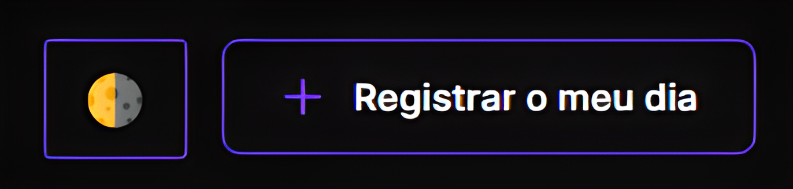

<h1 align="center"> Habits </h1>

Evento exclusivo e gratuito, promovido pela Rocketseat para ensino de tecnologias WEB.

  <a href="#-tecnologias">Tecnologias</a>&nbsp;&nbsp;&nbsp;|&nbsp;&nbsp;&nbsp;
  <a href="#-projeto">Projeto</a>&nbsp;&nbsp;&nbsp;|&nbsp;&nbsp;&nbsp;
  <a href="#-layout">Layout</a>&nbsp;&nbsp;&nbsp;|&nbsp;&nbsp;&nbsp;
  <a href="#-diferencial">Diferencial</a>&nbsp;&nbsp;&nbsp;|&nbsp;&nbsp;&nbsp;
  <a href="#-licença">Licença</a>

  

 

  

## 🚀 Tecnologias

Esse projeto foi desenvolvido com as seguintes tecnologias:

- HTML e CSS
- JavaScript
- Git e Github

## 💻 Projeto

O App Habits, tem como intuito você saber quais hábitos diários você já concluiu e quais tens de concluir.
[Acesse o projeto nesse link](https://kauamntro.github.io/NLW-setup/)

## 🔖 Layout

Você pode visualizar o layout do projeto através [DESSE LINK](https://www.figma.com/community/file/1195327109778210238). 
É necessário ter conta no [Figma](https://figma.com) para acessá-lo.

## 🕶 Diferencial

Como a gente sempre deve inovar, nos desafiarmos e irmos além do esperado, quis fazer um diferencial, a partir
disso decidir testar meus conhecimentos em JS, e fazer um Theme Selector 🌗

  

## ⚖ Licença

Esse projeto está sob a licença MIT.

---

Feito com ♥ by Kauã e Rocketseat [Participe da nossa comunidade!](https://discord.gg/rocketseat)
